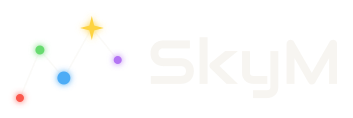

<h1 align="center">
  
</h1>

  <a href="docs/PRODUCT.md">Product</a> &nbsp;·&nbsp;
  <a href="docs/STEPS.md">Status</a> &nbsp;·&nbsp;
  <a href="docs/ROADMAP.md">Roadmap</a> &nbsp;·&nbsp;
  <a href="#implementation-entry-points">Implementation</a> &nbsp;·&nbsp;
  <a href="#getting-started-and-documentation">Documentation</a>

## What we're building

A FiveM-style platform for **No Man's Sky**, intended to let operators run persistent communities, creators build custom rules and activities, and players join distinct multiplayer experiences with community progression.

## Current state

A local standalone server and diagnostic client are implemented in **C#/.NET**. An experimental **Python adapter** connects native chat and an opt-in armed cockpit-entry report to the server, with automatic in-game replies and persistent member progress. The demonstrated scope is one client on one exact Windows Steam build. [STEPS](docs/STEPS.md#current-status) holds current capability status, limits and the next five tasks toward shared state with two real clients.

## Implementation entry points

| Entry point | Covers |
| --- | --- |
| [T-04.5](docs/tasks/T-04.5/README.md) | Current opt-in cockpit input, automatic replies, callback guards and recovery procedure |
| [T-04.4](docs/tasks/T-04.4/README.md) | Current persistent progress, read-only chat queries, database backup/restore and restart verification |
| [T-04.1](docs/tasks/T-04.1/README.md) | The local server |
| [T-04.2](docs/tasks/T-04.2/README.md) | Native adapter guards and disposable-save setup |
| [T-04.3](docs/tasks/T-04.3/README.md) | Connected chat operation, commands and game checks |

> The first playable goal is [one player connected to their own server](docs/PRODUCT.md#proposed-first-playable-milestone-one-player-and-their-server), performing an in-game action and seeing a result determined by that server. Follow [STEPS](docs/STEPS.md) for the current implementation task and its prerequisites.

## Getting started and documentation

Open this repository in an editor to review the documents; no game installation or development toolchain is needed for that. For project work, begin with AGENTS, PRODUCT, and STEPS below, then follow the selected task's linked records for procedures, evidence, and implementation entry points as code is added.

| Document | Purpose |
| --- | --- |
| [PRODUCT](docs/PRODUCT.md) | Intended users, experience, scope, and success criteria |
| [STEPS](docs/STEPS.md) | Current delivery status and queued work |
| [ROADMAP](docs/ROADMAP.md) | Provisional engineering path, milestone outcomes, dependencies, and uncertainty |
| [ARCHITECTURE](docs/ARCHITECTURE.md) | Proposed components, authority boundaries, security, and operations |
| [RESEARCH](docs/RESEARCH.md) | Dated findings, sources, alternatives, economics, and uncertainties |
| [EXPERIMENTS](docs/EXPERIMENTS.md) | Experiment catalog, common lab rules, and evidence format |
| [Working task references](docs/tasks/README.md) | Reusable procedures, contracts, sources and evidence needed by current work |
| [BACKLOG](docs/BACKLOG.md) | Conditional later work |
| [DECISIONS](DECISIONS.md) | Recorded choices, reasons, and revisions |
| [AGENTS](AGENTS.md) | Working instructions and document ownership |

---

This is an independent project, with no claimed affiliation with Hello Games or Cfx.re. See [LICENSE](LICENSE) for licensing terms.
