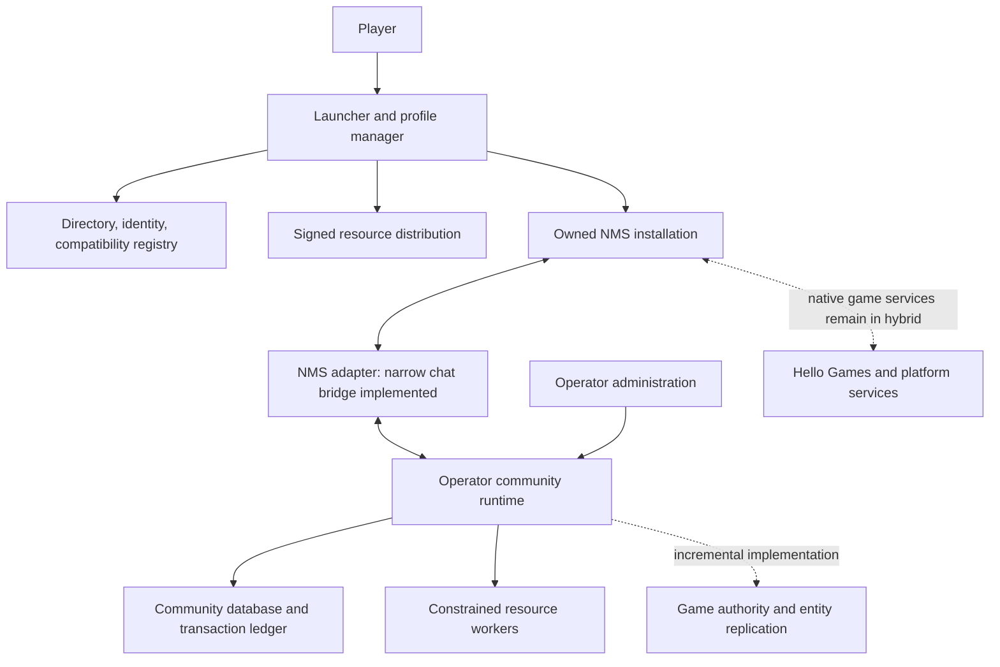

# Proposed architecture

This document describes the broader **design to test**, not a validated NMS server SDK. The implemented narrow chat/service boundary is documented in [T-04.3](tasks/T-04.3/README.md). External capability evidence belongs to [RESEARCH](RESEARCH.md); test procedures belong to [EXPERIMENTS](EXPERIMENTS.md); delivery state belongs to [STEPS](STEPS.md).

## Construction sequence and hosting options

The current proposal starts with a runnable server process, adds one real NMS client and a bounded in-game request/response, then extends that loop with durable reconnect and two-client synchronization. This separates ordinary service work from the unverified game bridge. [ROADMAP](ROADMAP.md) defines the proposed milestones and records uncertainty across the task breakdown.

Player count, hosting mode, and authority are separate design choices:

| Dimension | Initial implementation | Later work |
| --- | --- | --- |
| Connected players | Zero or a synthetic client for service development, then one real game client | Two real clients, then tested community sizes |
| Hosting | Separate service process on the same PC as the player's game | Another machine, documented dedicated deployment, optional listen-server mode |
| State | One server-owned configuration value and interaction state | Persistent contracts, resources, economy, and replicated game entities |
| Gameplay authority | One bounded in-game response controlled by the server | Admission, adversarial enforcement, and more entity/rule classes |
| When empty | Retain state; pause work or apply declared elapsed-time rules on return | Continuous background simulation only for resources that require it |

A listen server depends on its hosting game process. A separate community service may control its own records while still depending on native sessions for game admission. These distinctions affect hosting and enforcement claims independently of player count.

## 1. Separate community services from game simulation

The intended platform has three layers: distribution and identity, an operator-owned community runtime, and a game-specific client adapter. Its defining question is how much game state the runtime can authoritatively own.

The native-services edge must be measured. A hybrid may retain it for matchmaking, presence, or gameplay. Independent hosting requires a documented separation: which services remain for legitimate identity or ownership, and which service owns admission and simulation. This project does not assume permission or ability to redirect a publisher service.

A central directory should help discovery and publish compatibility/revocation information. A community server should own its records and expose an authenticated direct connection route. If the directory fails, already established community sessions should continue where their authentication and game dependencies permit. This behavior needs a test before it becomes a public availability claim.

## 2. Authority contract

| State or decision | Proposed owner | Trust boundary and required proof |
| --- | --- | --- |
| Platform login, join token, community membership | Identity service and operator runtime | Verify provider response, token audience, expiry, nonce, and role scope; never trust a supplied display name |
| NMS entitlement and current game identity | Approved storefront/publisher route, unresolved | Account login and presence of an executable do not establish legitimate entitlement or a trusted running client |
| Community role, contract acceptance, credit ledger | Operator runtime | Transactional writes, server-generated IDs, authorization, idempotency, auditable administrative adjustments |
| Completion of a physical game action | Unresolved game authority boundary | Hooks can observe reports; server-verifiable action evidence or actual simulation authority is still required |
| Official currencies, inventory, saves, discoveries | Existing game systems | No automatic conversion, overwriting, or claim of server validation |
| Player movement, damage, building, NPCs | Existing game until proven otherwise | Each override needs prevention/correction tests against native behavior and a noncompliant client |
| Custom entities and rules | Proposed simulation runtime | Stable IDs, ownership, lifecycle, late join, disconnect, region changes, and reconciliation |
| Community resource configuration | Operator, within platform capabilities | Tenant isolation, schema versioning, quotas, restricted execution, audit trail |

Platform-signed packages establish provenance; they do not prove a running client is unmodified. A client-held secret or local file checksum is not an anti-cheat trust root. If game evidence is client-reported, label the corresponding rule cooperative or moderated. The system may secure its ledger while still lacking a trustworthy reason to award credits.

An operator controls its own self-hosted database and can change its community's policy or ledger. Do not promise protection from a malicious operator. Cross-community currency would need a separate governance and trust model.

## 3. First game connection and the later gameplay slice

First, the server loads an operator-set interaction rule. One running NMS client sends the selected game interaction through the adapter, the server chooses the response, and the adapter displays or applies that response inside the game. Change the server configuration and repeat to demonstrate control. Disconnect the service and confirm the client reports failure without fabricating a successful result. E-10 specifies this milestone; no second player or complete economy is required.

Add state persistence and restart recovery next. The result may initially be cooperative while the adapter is developed; that is valid progress with an explicit trust boundary. Adversarial enforcement is a separate task. The contract below is the subsequent gameplay slice built on that connection.

The proposed activity is an RP salvage contract with one project-owned interaction object and community credits with no promised cash value or redemption. The object must be visible and usable inside the game to count as game integration. A web button is useful only for testing the service separately.

1. The operator starts a community runtime and enables the sample resource.
2. A player authenticates, selects the community, and receives its manifest and compatibility requirements.
3. The launcher checks the local build, installs approved content transactionally, and starts the tested join flow.
4. The runtime issues a session-scoped contract and object ID. The adapter presents the supported interaction.
5. The player interacts. The runtime validates the command and the available gameplay evidence. If the evidence is insufficient for enforcement, record the specific missing control and develop the next adapter or validation change; preserve the functioning cooperative interaction.
6. In one database transaction, the runtime advances the contract and posts balanced ledger entries with a unique completion ID.
7. A committed event is delivered to clients. They render the updated state and can query its revision after reconnecting.
8. Restarting the service or replaying the request returns the existing result. An administrator can trace the outcome and issue a compensating adjustment.

The service should never accept a client-supplied reward amount. A signed or encrypted event is still untrusted if the client can fabricate the action it describes.

## 4. Protocol and persistence

The current one-process local-disk implementation uses SQLite, stable member IDs, atomic state/event/replay commits, a 24-hour replay window and idle empty-server behavior. [T-04.4](tasks/T-04.4/README.md#storage-identity-and-recovery-contract) owns its concrete storage and maintenance limits; the [wire reference](tasks/T-04.1/protocol.md) owns protocol version 2. The broader designs below remain proposals beyond that scope.

For the first local service proof, HTTP/WebSockets may run on explicitly bound loopback addresses with scoped lab credentials, request limits, and appropriate browser-origin checks. Do not bind this lab configuration to all network interfaces. Remote connections require authenticated encryption and server-identity verification under R-089; the local exception must not become an automatic remote downgrade. Choose and record the initial transport at R-004. TCP/WebSockets are a reasonable prototype option for RP commands; they are not a performance conclusion for high-rate movement replication.

Proposed command fields: protocol version, community ID, session ID, request ID, expected state revision, command type, and bounded payload. Derive the actor and role from the verified session. Bind replay protection to actor, community, command, and expiry. Use server time for deadlines; record client times only as observations.

Separate commands from notifications and asset transfers. Validate schema, length, entity visibility, membership, capabilities, rate, ordering, and allowed state transition before invoking a resource. A resource must not turn an arbitrary event name into unrestricted remote execution.

Admission negotiates the tested game fingerprint, storefront, adapter/protocol version, active resource hashes, relevant configuration, and native game mode. Detect loaded content where possible and reject unsupported combinations. Downloading the same manifest does not prove the same content is active; these are compatibility checks, not anti-cheat attestation.

Proposed records:

| Record | Essential properties |
| --- | --- |
| Community | Stable ID, operator, policy version, admission mode |
| Membership | Account/community key, roles, sanctions, audit metadata |
| Session | Principal, community, expiry, revocation, negotiated capabilities |
| ResourceVersion | Publisher, hash, manifest, dependencies, permissions, supported builds |
| ContractInstance | Resource version, participants, state/revision, completion ID |
| LedgerTransaction and LedgerEntry | Immutable transaction ID, integer amount, community/currency, balanced entries, reason |
| EntitySnapshot | Entity ID, authoritative revision, ownership, state, migration version |
| AuditEvent | Actor, action, target, timestamp, correlation ID; no credentials |

The first persisted progression value belongs to a community member, identified by a server-owned stable member ID within a community. Session IDs, display names, and native save IDs are not durable owner keys. In the local lab, persist the explicit mapping from the configured test principal to that member ID. Later character records reference a member and have their own stable IDs. Resources must explicitly choose member-owned or character-owned progress/accounts; adding characters must not silently copy or move existing balances. Implement any ownership change as a reviewed migration with conservation and recovery tests.

Use a transactional database for money and contract state; PostgreSQL is a candidate, not an installed dependency. A transactional outbox or equivalent can make committed changes eventually deliverable without pretending network delivery is exactly once. Clients deduplicate committed event IDs and repair gaps through a snapshot plus subsequent revisions. Reversals create compensating records; do not silently rewrite financial history.

Design schema migrations with backups and a restore test. Do not automatically downgrade persisted data when rolling back a binary. Define whether zero-player timers pause, advance continuously, or are computed on return. Persisted state can sit idle while the server is empty. First verify storage and reconnect; use E-07 later to test any game rule claimed to advance independently of a logged-in client.

## 5. Client and resource boundaries

Evaluate the minimum native adapter surface: game lifecycle, input/interaction event, object presentation, state application, and clean unload. Prefer a small typed interface to scattering offsets throughout resource scripts. Each operation declares its allowed thread, valid game states, supported build fingerprints, and failure behavior.

The current opt-in lab operation uses guarded fresh state reads at application-update completion to present delayed replies and report one armed cockpit entry. [T-04.5](tasks/T-04.5/README.md#receiver-validation-and-selected-automatic-operation) owns its exact-build/thread contract, cancellation behavior and evidence. It supplies a cooperative observation and local presentation boundary; it does not establish gameplay authority or a general lifecycle API.

Possible adapter technologies include a maintained Python hook path for exploration and a narrow native implementation for distribution. Their feasibility, license obligations, memory safety, packaging, and update burden must be measured before selection. An existing hook framework's online-functionality exclusion must be respected when choosing an upstream contribution or dependency strategy. It is not a hidden multiplayer API.

Proposed resource manifest fields:

- Identity, version, publisher, license, attribution, source URL, and content hashes.
- API/protocol versions, supported game build fingerprints and storefronts.
- Separate server scripts, client data, optional UI, and declared dependencies/conflicts.
- Capabilities, resource limits, migration version, and lifecycle hooks.

Begin with declarative activities and one constrained server resource runtime. Lua or WebAssembly are candidates; neither is a security boundary merely by being chosen. Validate the actual runtime's filesystem, process, network, CPU, memory, and execution-time controls. Run resources in isolated workers with explicit host capabilities. Avoid unrestricted player-downloaded DLLs and unrestricted Lua/Python evaluation in the retail process.

Pin resource versions for each session and begin with restart-based upgrades. Specify dependency start/stop order, outstanding callback cancellation, in-flight command handling, entity cleanup, and schema migration before replacing a resource. Hot reload remains unsupported until the adapter's lifecycle safety is demonstrated.

The launcher needs transactional install receipts, content-addressed caching, complete hash checks, safe archive extraction, staged writes, interruption recovery, and exact uninstall. It must reject paths outside the selected profile/game directories, symlink escapes, oversized archives, missing dependencies, and incompatible builds. Existing files need provenance before replacement; never treat all game-folder files as platform-owned.

Profile isolation is itself an experiment. The design does not assume the game supports an alternate save or mod directory. Do not claim safe separate profiles until cloud sync, startup settings, and restoration have been exercised. Use disposable saves in the lab and do not disable a user's cloud service globally as a shortcut.

Also test whether custom construction, entities, progression, or discoveries are uploaded through native sharing or save services. A selected community, separate platform database, or disabled multiplayer toggle does not prove isolation from those writes. Keep the initial proof disposable until the relevant upload paths and restoration behavior are understood.

## 6. Independent networking work, if the bridge permits it

Define identity for galaxy, system, planet, native session/instance, and reference frame before synchronizing entities. Specify transforms between planetary and space coordinates and moving freighter/corvette frames. Equal position numbers are meaningless without their frame. Generate project-owned entity IDs independently of process-local pointers. Determine which procedural objects need reconstruction and which require explicit snapshots. Avoid double-simulating objects simultaneously owned by native networking and the platform.

For each entity class establish authoritative owner, control transfer, spawn/despawn, interest selection, state serialization, interpolation, reconciliation, and persistence. Test coordinate changes between planets, systems, freighters/corvettes, and bases. A single static object proof does not establish combat, NPC AI, terrain generation, construction, or vehicle physics.

If the project must simulate the relevant physics or AI itself, that is substantial new engine work. No design choice of relay, message broker, or database supplies it. Retain a feature-by-feature boundary instead of promising to replicate the whole universe.

A standalone service retaining roleplay balances is a valid community-server component. A server controlling an in-game action for one player is a stronger game-integrated milestone. Independently simulated game rules add another capability and need their own evidence. None of these requires reproducing every engine system. Game-admission control and dependence on native multiplayer remain explicit separate tasks.

Publish the demonstrated boundary as a list of server-owned, client-delegated, and native-owned behavior. Passing one interaction or timed object never implies independent NPC, combat, terrain, or physics simulation.

Potential adapter failures include thread/lifecycle misuse, a wrong structure/signature, native state overwriting a result, ownership ambiguity, or an unavailable operation. A reproduction helps distinguish these causes. A different hook point, a custom entity, a revised ownership protocol, or a supported interface are candidate approaches whose suitability depends on the observed failure. Some findings could instead undermine the proposed architecture or the cost assumptions behind it.

## 7. Security and moderation requirements

| Threat | Proposed control | Test |
| --- | --- | --- |
| Forged/replayed reward | Server-owned values, state transition checks, idempotent transaction | Replay, wrong actor/community, stale revision, edited save |
| Malicious resource | Curated signed packages, restricted workers, capability allowlist | File/network escape, endless loop, excessive allocation, crash |
| Stolen session | Short-lived scoped credentials, secure local storage, revocation | Expired/stolen token cannot join another community or act after revocation |
| Malicious server entry | Validated endpoint metadata, explicit operator identity, bounded discovery | Reject unsafe URL schemes, local-network probing, token-forwarding traps |
| Unsafe installer/update | Signed release metadata, hashes, atomic activation, compatibility gate | Tampered package, interrupted download, old manifest, build mismatch |
| Griefing and admin abuse | Scoped roles, sanctions with reasons, audit logs, appeal/export flow | User cannot self-promote; admin action is attributable; ban boundary is accurately shown |
| Unavailable service or split state | Backpressure, snapshots, transaction durability, tested restore | Outage during commit, service restart, stale reconnect, failed migration |

Rate-limit unauthenticated joins and expensive commands. Keep resource downloads separate from gameplay traffic. Select hosting with suitable network protections after measuring protocol needs. Do not label a ban effective in native multiplayer merely because platform API access is revoked.

Collect only necessary identifiers and diagnostics. Keep raw saves, voice recordings, and account tickets out of ordinary telemetry. Draft retention, deletion/export, report handling, and operator responsibilities before a public pilot; set actual periods when the service model and jurisdictions are chosen. This is an operational design requirement, not a completed compliance assessment.

## 8. Updates, operations, and launch

Maintain a compatibility matrix keyed by game build, storefront, adapter version, resource manifest, and tested behavior. Distinguish untested, supported, degraded, and disabled. A patch should not silently reuse unknown hook addresses. Stop integration safely and preserve the player's restoration path when validation fails.

Use development, canary, and stable release channels. Keep signing keys separate from routine build jobs; record artifact provenance, dependency licenses, and the selected source revisions. Support package revocation and emergency disabling of an unsafe integration. Rollback an adapter only against a compatible legally available game build; a launcher cannot promise to roll back the player's retail game.

Initial metrics: join success and time, install/restore failures, supported-build coverage, adapter crashes, command latency, duplicate rejection, state divergence, restore time, traffic per player, resource worker timeouts, and operator support minutes. Avoid recording secrets or full game memory.

Proposed pilot recovery targets: database recovery point at most one hour for disaster recovery and service restoration within four hours, with every acknowledged transaction surviving an ordinary process restart. These are different failure cases. Prove backup restoration and disclose measured results before offering an uptime or durability commitment.

Launch acceptance requires a documented install-to-join-to-play-to-recover flow run by someone other than its author; tested permissions and resource boundaries; clear support/build coverage; a real incident/rollback exercise; and resolution of the applicable rights and entitlement questions. A clean application build or a load test of mock clients alone cannot satisfy it.
