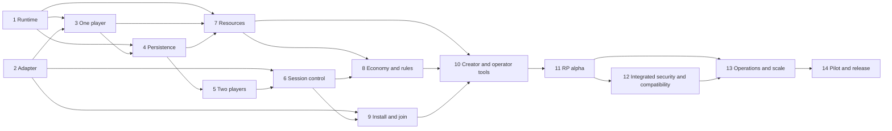

# Engineering roadmap

Updated: 2026-09-23.

The intended platform lets operators run persistent No Man's Sky communities, creators define meaningful gameplay, and players join those communities inside the game. This provisional plan contains **140 engineering tasks across 14 stages**, from the first server process to a supported public release. The count describes the current breakdown; it does not establish completeness, effort, cost, or whether every proposed integration can be delivered.

[PRODUCT](PRODUCT.md) owns the intended experience and the context behind this plan. [STEPS](STEPS.md) owns actual delivery status, completion evidence, and the next few detailed implementation tasks. This document owns the longer-range breakdown and proposed acceptance criteria. [ARCHITECTURE](ARCHITECTURE.md) owns the proposed design; [EXPERIMENTS](EXPERIMENTS.md) provides repeatable procedures for difficult integrations; [RESEARCH](RESEARCH.md) owns external claims and sources.

## Planning confidence and open dependencies

The first proposed route is a standalone service, one real game connection, persistent reconnect, and then a second player. The service has a local verification path independent of the game. The playable milestone requires a running retail game and an adapter operation that has not yet been demonstrated.

Hosting mode, game authority, persistence, and player count are separate dimensions. An operator may eventually choose a listen host, a separate server process on their own PC, or a remote dedicated host where the demonstrated integration permits it. Durable state can remain idle while no players are connected and catch up on return. Recreating all native physics, procedural generation, or continuous zero-player simulation is not a prerequisite for every persistent feature.

The workstreams have different levels of definition. A detailed row is a proposed deliverable and check, not evidence that its required game capability is available.

| Work | What is reasonably concrete now | What remains tentative |
| --- | --- | --- |
| R-001–R-010: local service | A configured process, bounded protocol, synthetic client, and observable lifecycle can be specified without game access. | Selected tooling, transport and implementation evidence belong to the task records linked from STEPS. They do not settle the game-facing interface. |
| R-011–R-040: adapter, one player, persistence | The desired in-game round trip and restart behavior have explicit proposed checks. Ordinary storage work can use original fixtures. | The first game operation, hook route, lifecycle constraints, and reliable application of server responses are unverified. |
| R-041–R-060: synchronization and session control | Shared-state, admission, ownership, and enforcement are necessary capabilities for the selected experience. | This contains the largest architectural uncertainty. Native-session dependencies and available control may change the design, task boundaries, and sequence substantially. |
| R-061–R-110: resources, economy, installation, tools, RP | The operator/creator workflows and trust concerns identify useful work areas. | API shape, supported mechanics, packages, and interaction design depend on earlier game capabilities and outside-user experience. Specific solutions remain candidates. |
| R-111–R-140: security, compatibility, operations, release | Security review, recovery, maintenance, pilot evidence, and release preparation are identified workstreams. | Exact tests, capacity targets, costs, operating model, and release scope depend on the implemented system. Security work also belongs in each earlier interface as it is built. |

The rows mix intended outcomes with candidate technical choices. Active work receives exact implementation details and evidence in STEPS. New findings may split, replace, retire, or add work while retaining stable references. The dependency map records the current design assumptions, including integration checks that require multiple components; it is subject to the same revisions. Acceptance evidence applies to the tested build and feature scope.

## Milestones

| Milestone | Observable result | Boundary of the claim |
| --- | --- | --- |
| M-01 — Runnable server | An operator starts, connects a test client to, observes, and cleanly stops the community runtime. | Real server software; game integration comes next. |
| M-02 — One player in game | One retail NMS client performs an in-game action, the separate runtime decides a result, and the adapter applies a visible in-game response. | Valid first playable server milestone; no two-player or whole-engine requirement. |
| M-03 — Persistent community state | The player disconnects, the runtime restarts with no clients connected, and the returning game client receives the acknowledged state. | Durable state for the tested feature; zero-player continuous simulation is a separate feature. |
| M-04 — Shared state | Two real game clients observe and interact with the same project-owned state, including late join and conflict handling. | Demonstrated two-player behavior; higher capacity remains unmeasured. |
| M-05 — Operator control | The operator controls admission to the declared game environment and enforces selected gameplay rules within a tested authority boundary. | Platform API bans alone do not demonstrate game admission; native dependencies remain explicit. |
| M-06 — Creator/operator alpha | Another creator builds a playable resource and another operator runs a coherent RP community using the documented tools. | Reusable platform with a stated feature and hosting boundary. |
| M-07 — Reliable community pilot | Consenting pilot users play the selected scope; operators complete measured recovery, update, and support exercises. | Evidence for the tested builds, client counts, conditions, and operating model. |
| M-08 — Public release | The supported package, operator workflow, documentation, release scope, and operating arrangements satisfy recorded release criteria. | Public claims match demonstrated capabilities and applicable distribution rights. |

M-05 establishes the tested admission and rule-control boundary. A remaining native player host is still a hosting dependency. Likewise, proving one independent entity class does not prove independence for native NPCs, combat, terrain, or every other game system.

## Dependencies and parallel work

| Workstream | Can start when | Needed before its full acceptance |
| --- | --- | --- |
| Stage 1: runtime | The current product and protocol intent are available. | Its local lifecycle demonstration. |
| Stage 2: adapter | A selected owned lab installation and disposable profile are available. | A repeatable bridge on the selected game build. |
| Stage 3: one player | Stage 1's command path and Stage 2's input/output operations exist. | Both working together in a real game run. |
| Stage 4: persistence | Stage 1's state model exists; storage work can use a synthetic client. | Stage 3's actual in-game reconnect/restart run. |
| Stage 5: two players | Stage 3 works and two consenting lab clients are available. | Stage 4's revision and recovery semantics. |
| Stage 6: session control | Stage 2 exposes relevant lifecycle behavior; design and dependency measurements can start early. | Stage 5's shared state plus actual admission and rule-enforcement evidence. |
| Stage 7: resource runtime | Stage 1's command boundary exists. | Stage 3's adapter operations and Stage 4's durable resource state. |
| Stage 8: economy/rules | Stage 4's transactions and Stage 7's resource interface exist. | Relevant Stage 6 controls for every rule advertised as enforced. |
| Stage 9: installation/join | Stage 2 establishes reversible installation and version detection. | Actual Stage 3 joins and the selected Stage 6 hosting route. |
| Stage 10: creator/operator tools | Stage 7's resource format and Stage 9's package format stabilize. | Stages 4, 6, 8, and 9 supply the features those tools expose. |
| Stage 11: RP alpha | Stages 7 and 8 expose playable mechanics. | Stages 9 and 10 support outside users; Stage 6 supports the declared rules. |
| Stage 12: security/compatibility | Each affected interface exists; its defenses belong in the implementation from the start. | The selected alpha's complete trust and update boundaries. |
| Stage 13: operations/scale | Stage 1 can emit metrics and Stage 4 can create backups. | Stages 11 and 12 provide the integrated pilot candidate. |
| Stage 14: pilot/release | Packaging and operating scope are concrete enough to review. | Stages 11–13, actual pilot evidence, and the conditions of the affected external release. |

The arrows summarize the proposed integration sequence. For example, final economy enforcement depends on game control, although ledger work can be developed earlier. Independent preparation and prerequisites for the current queue are recorded in STEPS. Authorization for external actions is governed by AGENTS.

## Stage 1 — Build the standalone community runtime

R-001 through R-010 establish server software with a synthetic client. This work can run beside Stage 2.

| ID | Concrete outcome | Observable acceptance |
| --- | --- | --- |
| R-001 | Select the initial runtime language, process model, and development tooling against adapter interoperability, operability, and team constraints. Pin the chosen SDK and dependency versions. | A decision record compares viable choices and supplies a reproducible build/run command from a fresh checkout; M-01 does not require a production database. |
| R-002 | Define a versioned command/response/event contract and original reusable fixtures for one community action, including community, request ID, and revision; derive the authoritative actor from the verified lab session. | Valid and invalid messages produce documented parse results; shared fixtures can test the server and future adapter; supplied actor/reward fields cannot override server decisions. |
| R-003 | Implement a configurable server process with community identity, bind address, data location, startup validation, and shutdown handling. | The process starts on a chosen local endpoint, rejects invalid configuration, and releases its port on stop. |
| R-004 | Select and implement the first transport for low-frequency commands, with explicit size and timeout bounds. | A synthetic client completes a request/response cycle; oversized or incomplete input terminates predictably without crashing the process. |
| R-005 | Add development session identity and community-scoped authorization using clearly marked lab credentials. | Two test identities receive distinct sessions; an expired session or a request for another community is rejected. |
| R-006 | Implement one project-owned interaction state machine with server-assigned IDs and allowed transitions. | Legal commands change its revision; illegal transitions return a stable error and leave state unchanged. |
| R-007 | Deliver committed state-change notifications and a current-state query endpoint. | A connected synthetic client observes a change, and a client that missed it obtains the same revision through a query. |
| R-008 | Add structured startup, connection, command, rejection, and shutdown diagnostics with correlation IDs. | One request can be followed across the logs without logging credentials or proprietary game data. |
| R-009 | Build a small diagnostic client that connects, submits commands, disconnects, and deliberately sends malformed or duplicate input. | A documented invocation reproduces the normal path and the selected failure cases on a fresh checkout. |
| R-010 | Package the local server lifecycle demonstration, pinned setup, and repeatable service/contract test command. Reuse that command in automated CI when hosting is configured. | A fresh checkout builds and tests without game files; start/connect/operate/disconnect/stop/restart succeed without hand edits. Record **M-01**, its synthetic-client scope, and whether CI actually ran. |

## Stage 2 — Establish the game adapter and reversible lab workflow

This stage starts independently of Stage 1. Use the current research to select candidates; no listed hook framework is assumed to provide a working multiplayer API. E-02 and the applicable parts of E-03 provide deeper lifecycle checks.

| ID | Concrete outcome | Observable acceptance |
| --- | --- | --- |
| R-011 | Record one owned storefront/build, hardware setup, disposable save, and relevant native settings as the lab baseline. | Another run can identify the same build and restore the declared lab configuration from the written procedure. |
| R-012 | Build a reversible installation receipt for a harmless selected modification and inspect save/cloud-sharing behavior. | The intended change appears; uninstall restores platform-owned changes and preserves unrelated files, with unresolved upload paths recorded. |
| R-013 | Compare candidate adapter routes against the exact lifecycle, interaction, and presentation operations needed for M-02. | A capability table cites candidate evidence, selected source revisions/licenses, missing operations, and a concrete first route. |
| R-014 | Create an adapter scaffold that recognizes the selected build and refuses unsupported fingerprints or ambiguous bindings. | The supported lab process loads the scaffold; a controlled mismatch disables integration without attempting unknown bindings. |
| R-015 | Expose game startup, playable-state entry, menu return, and shutdown through a narrow adapter interface. | Logs identify those transitions across repeated launches without retaining references after their valid lifetime. |
| R-016 | Implement one minimal input or interaction observation from the running game. | A deliberate in-game action emits one typed adapter event with an attributable lifecycle and duplicate behavior. |
| R-017 | Implement one reversible in-game presentation or state operation, using the smallest viable game surface. | Applying and removing a test state produces an observable result inside the game and leaves the disposable profile recoverable. |
| R-018 | Establish safe execution-thread and object-lifetime rules for adapter operations. | Menu transitions, travel where relevant, and unload cannot execute a queued operation against an expired game object. |
| R-019 | Create the local communication boundary between the adapter and the eventual network client. | Bounded typed messages cross the boundary; a peer disconnect cannot block the game's update thread indefinitely. |
| R-020 | Run the adapter lifecycle demonstration and retain a reproducible defect case for any unsupported transition. | Repeated load/action/output/unload runs succeed for the declared scope, with measured overhead and any remaining lifecycle limits recorded. |

## Stage 3 — Connect one real player to their server

Needs the usable command path from Stage 1 and input/output operations from Stage 2. A terminal action or external browser button is insufficient for M-02. E-10 owns the focused one-player test procedure.

| ID | Concrete outcome | Observable acceptance |
| --- | --- | --- |
| R-021 | Add explicit community endpoint selection to the lab client, initially through simple configuration. | The same game installation connects to either of two local test endpoints and identifies the selected community correctly. |
| R-022 | Negotiate adapter, protocol, build, and basic resource requirements before accepting gameplay commands. | A supported combination connects; a controlled incompatible combination gives a specific rejection and safe recovery route. |
| R-023 | Bind the adapter's active player session to the server's lab identity and connection lifecycle. | Reconnecting creates the documented session behavior; commands from a closed or wrong-community session are rejected. |
| R-024 | Send the chosen in-game input through the adapter to the community runtime. | A correlation record links one retail-game interaction to the corresponding server command without a manual backend trigger. |
| R-025 | Make the runtime decide a visible result from server-owned interaction state. | Changing the server's permitted state changes the result; the command cannot choose its own authorized outcome. |
| R-026 | Apply the returned result inside the game through the adapter's reversible operation. | The player observes the correct response after the server decision; a rejected action produces its documented in-game feedback. |
| R-027 | Handle latency, timeout, and duplicate input in the playable interaction. | Delayed or repeated commands do not freeze input, apply the result twice, or leave a permanent pending indicator. |
| R-028 | Surface connection state and errors in a minimal readable in-game presentation. | The player can distinguish connecting, connected, rejected, disconnected, and retrying states without consulting developer logs. |
| R-029 | Define loss-of-server behavior and cleanly detach the adapter from the active community. | Stopping the runtime during interaction returns control to the documented safe state; reconnect and ordinary game exit remain possible. |
| R-030 | Run and document the one-player server/game round trip. | One retail client joins its server, triggers a server-decided action, and sees the in-game result; record **M-02** without requiring a second player or complete simulation. |

## Stage 4 — Make community state survive absence and restart

Storage and transaction work can start with the Stage 1 client. Completing M-03 requires the actual Stage 3 game integration. E-05 supplies adversarial transaction cases; continuous offline simulation is optional per feature.

| ID | Concrete outcome | Observable acceptance |
| --- | --- | --- |
| R-031 | Choose durable storage and define community, member, and interaction records with versioned migrations. Give the first progression value an explicit community-member owner using stable server IDs. | Reconnecting under a new session restores the same member's value; native save IDs/display names cannot change ownership, and later character records can be added without copying or ambiguously inheriting balances. |
| R-032 | Persist the sample interaction and contract state in a transaction. | A committed action is readable after process restart, and a rejected action leaves no partial state transition. |
| R-033 | Add actor/community-bound idempotency records for mutating commands. | Repeating the same request returns its original outcome; reusing its ID with a different payload is rejected. |
| R-034 | Add revision-based conflict handling for state changes. | Concurrent commands targeting one prior revision produce the documented winner/conflict result without a lost update. |
| R-035 | Implement commit-to-notification recovery using an outbox or another explicitly justified durable mechanism. | Terminating the process after commit but before delivery does not lose the change; clients can recover its state. |
| R-036 | Restore a player's community state during reconnect using a snapshot and bounded revision recovery. | A returning game client displays the server's current state after deliberately missing several events. |
| R-037 | Define and implement the no-player policy for each initial timer or scheduled rule. | A test distinguishes paused, computed-on-return, and continuously scheduled behavior; only supported policies are exposed to creators. |
| R-038 | Add backup, restore, and schema-upgrade commands for the first persistent model. | A backup restores on a fresh data directory; a deliberately failed migration preserves a documented recovery path. |
| R-039 | Exercise interruption before commit, after commit, during notification, and during reconnect. | Every acknowledged state change survives the tested process failures; unacknowledged outcomes can be queried without duplicate execution. |
| R-040 | Demonstrate persistence through a real player's disconnect, an empty server, restart, and return. | The retail client receives the same acknowledged progression after restart; record **M-03**, including each feature's zero-player policy. |

## Stage 5 — Synchronize two players and shared interactions

Needs the Stage 3 game path, Stage 4 recovery semantics, and two consenting lab clients. Use E-01 and E-04 to distinguish native replication from custom replication rather than guessing which layer owns an observed result.

| ID | Concrete outcome | Observable acceptance |
| --- | --- | --- |
| R-041 | Record the two-client native session baseline and both players' view of the chosen interaction location. | Join, leave, late join, and relevant travel have paired observations identifying failures and suspected native ownership. |
| R-042 | Define stable project-owned entity IDs and explicit location/reference-frame identifiers. | Both clients identify the same test entity and coordinate frame without using process-local addresses as shared IDs. |
| R-043 | Serialize the selected shared entity's state and lifecycle through the community runtime. | Spawn, change, and despawn commands produce a coherent revision sequence understood by two synthetic consumers and the adapters. |
| R-044 | Present the same project-owned interaction state to both game clients. | A server-issued state change appears correctly in both real game views without relying on manual matching actions. |
| R-045 | Resolve two players acting on the same interaction. | Simultaneous requests produce the declared exclusive or cooperative outcome, and both players converge to its authoritative revision. |
| R-046 | Implement late-join snapshots and recovery from missed or out-of-order events. | A second player joining after several state changes observes the current result without replaying obsolete effects. |
| R-047 | Define subscriptions and cleanup for the first supported region or instance boundary. | Leaving and returning removes stale presentations and restores the correct entities; unrelated communities receive no state. |
| R-048 | Handle a participant disconnect without leaving orphaned ownership, locks, or callbacks. | Abruptly closing either client releases or transfers the declared responsibilities and allows the other player to continue appropriately. |
| R-049 | Compare native and custom ownership under duplicated presentation and conflicting state scenarios. | The selected entity has one documented owner; detected native overwrite or double-spawn cases have a reproducible fix or an open integration task. |
| R-050 | Run the shared-state interaction, late join, conflict, and restart sequence with two real clients. | Both players observe the expected persisted result throughout; record **M-04** and the exact game/transport dependencies. |

## Stage 6 — Give operators control over hosting, admission, and selected gameplay

Start dependency measurements as soon as the adapter is usable. This is a substantial integration workstream and may need further decomposition. M-05 needs actual control of the declared game environment; a successful platform login service does not finish it. E-06 tests control; E-07 separately tests any claimed independent simulation.

| ID | Concrete outcome | Observable acceptance |
| --- | --- | --- |
| R-051 | Map observed dependencies for discovery, identity, transport, session hosting, entity ownership, and persistence. | A traceable table separates required native behavior from platform-owned behavior and labels every untested dependency. |
| R-052 | Specify operator-hosting modes and select the first integration route for listen and/or separate-process operation. | Each proposed mode states what runs where, what happens when its player host leaves, and which independence claims still need implementation. |
| R-053 | Add server-controlled session creation, join intent, and membership lifecycle to the adapter's available game-session surface. | The operator creates a declared session and an accepted player enters its intended in-game environment through the tested route. |
| R-054 | Implement the smallest adapter/session extension needed to give the platform ownership of the selected gameplay interaction. | The runtime creates and controls that interaction without a conflicting native owner; missing primitives produce specific follow-on tasks. |
| R-055 | Enforce invitation/allowlist admission and membership revocation across the platform and the selected game environment. | A consenting unauthorized or revoked test client cannot enter or interfere within the boundary promised for this hosting mode. |
| R-056 | Enforce negotiated game mode, active resource/configuration compatibility, and unsupported-client behavior. | A mismatched or disabled adapter is detected and handled according to the declared in-game admission policy; package hashes are not treated as anti-cheat proof. |
| R-057 | Implement one server-enforced gameplay permission beyond ledger access, such as using the project-owned interaction. | A denied player cannot obtain the protected gameplay effect through a forged command or the tested native interaction route. |
| R-058 | Implement the chosen authority recovery when a player host disconnects or a native session is lost. | The documented continuation, migration, or controlled shutdown preserves acknowledged state and communicates the actual interruption to players. |
| R-059 | Demonstrate the selected hosting boundary and pursue remaining independence tasks explicitly. | Separate-process and listen claims have real runs where supported; any claimed independent rule passes its scoped client-exit/rejoin test without implying a whole-engine replacement. |
| R-060 | Run the admission and gameplay-control challenge cases and publish the measured authority contract. | Record **M-05** only for controls that hold in game; unresolved native dependence remains visible work toward the intended platform. |

## Stage 7 — Make gameplay resources programmable and isolated

Start the server-side resource interface beside adapter work. Complete the stage with real game operations and persistent resource state; a scripting demo that only prints to a terminal is insufficient.

| ID | Concrete outcome | Observable acceptance |
| --- | --- | --- |
| R-061 | Specify a versioned resource manifest for identity, dependencies, permissions, configuration, build support, and migrations. | A valid sample loads, while missing permissions, incompatible API versions, and cyclic dependencies produce actionable errors. |
| R-062 | Select the initial resource execution model against isolation, determinism, tooling, and operational costs. | A comparison and runnable prototype demonstrate the selected model's actual host-capability boundary, rather than assuming a language is a sandbox. |
| R-063 | Implement resource start/stop lifecycle and dependency ordering. | Dependencies start in order; a failed dependency prevents dependent activation; shutdown releases registered handlers and owned state handles. |
| R-064 | Expose a small typed gameplay API for commands, events, entity presentation, and allowed state transitions. | A resource invokes the M-02 game operation through the public interface without importing private adapter bindings. |
| R-065 | Add community/resource-scoped persistence and migration hooks. | A resource retains its own data across restart and cannot read another resource's private records without an explicit capability. |
| R-066 | Enforce worker CPU/time, memory, event-rate, and host-access limits. | Deliberately looping, allocating, and unauthorized file/network access examples are contained while the community runtime stays responsive. |
| R-067 | Implement declared resource capabilities and operator-visible permission review. | A resource without a required capability cannot perform the operation; the operator can see why a package requests it. |
| R-068 | Support version-pinned resource upgrades with controlled stop, migration, activation, and recovery. | An in-flight command and a failed upgrade follow documented outcomes without duplicate entities or silently downgraded data. |
| R-069 | Port the original playable interaction from built-in server code to the resource API. | Its in-game behavior and durable state remain correct with no resource-specific change inside the game adapter. |
| R-070 | Implement a second original resource with different interaction rules using the documented API. | Both resources run together, retain isolated state, and fail independently, demonstrating that the API serves more than one hardcoded example. |

## Stage 8 — Implement community economy and enforceable rules

Build on Stage 4 transactions and Stage 7 resources. Integrate Stage 6's actual gameplay authority for each enforced rule. Community credits remain separate from official currencies and have no assumed cash redemption.

| ID | Concrete outcome | Observable acceptance |
| --- | --- | --- |
| R-071 | Define the first community currency, integer precision, accounts, transfer policies, and conservation rules. | Example issuance, reward, purchase, refund, and administrative adjustment cases reconcile under one documented accounting model. |
| R-072 | Implement immutable balanced ledger transactions with idempotency and account authorization. | Concurrent/duplicate transfers cannot overspend or post an unbalanced transaction; another actor's account cannot be spent. |
| R-073 | Connect a playable contract's completion and its reward in one durable transaction. | The game interaction yields one reward, or neither completion nor reward commits; the client cannot supply the reward amount. |
| R-074 | Strengthen the selected contract's gameplay validation against the specific evidence it uses. | Forged completion, stale state, wrong actor, replay, and invalid eligibility cannot earn the promised enforced reward; client-reported facts remain labeled. |
| R-075 | Add purchases and owned project-defined goods or entitlements through the same transaction boundary. | Payment and entitlement change atomically; retries cannot duplicate the item or charge, and native inventory integration is claimed only if separately demonstrated. |
| R-076 | Implement operator roles and permission evaluation for the first contract, shop, and administrative actions. | A role change takes effect on reconnect and live where promised; a player cannot grant themselves permissions or invoke administrator commands. |
| R-077 | Add one meaningful configurable gameplay restriction using the Stage 6 authority surface. | Two different operator configurations produce the documented in-game behavior, and the tested invalid interaction cannot bypass it. |
| R-078 | Add auditable corrections and compensating economy transactions. | An administrator can explain a disputed reward and reverse it through a traceable adjustment without rewriting ledger history. |
| R-079 | Build operator views for balances, contract events, suspicious repetition, and reconciliation errors. | A seeded duplicate/invalid-action incident is visible with its actor and cause, without exposing session credentials or raw saves. |
| R-080 | Run the complete earn, spend, permission-change, dispute, and recovery sequence with game clients. | Both clients and operator records agree after conflicts and restart; each rule is labeled enforced, cooperative, or moderated according to evidence. |

## Stage 9 — Package installation, updates, and joining

Begin reversible packaging after Stage 2 establishes actual installation behavior. Complete the join flow against the selected hosting route. A polished launcher does not substitute for unfinished game integration.

| ID | Concrete outcome | Observable acceptance |
| --- | --- | --- |
| R-081 | Define a package format and reproducible artifact layout for the adapter, client helper, and resources. | The same declared source/configuration produces traceable artifacts with hashes, versions, dependencies, and attribution records. |
| R-082 | Implement game-installation discovery with explicit supported storefront/build detection and a manual path option. | Supported, missing, ambiguous, and unsupported installations yield distinct outcomes without changing unrelated directories. |
| R-083 | Implement safe package download, extraction, staging, and atomic activation. | Interrupted, oversized, tampered, traversal, and symlink-escape packages cannot activate or write outside approved locations. |
| R-084 | Implement install receipts, conflict handling, exact uninstall, and interrupted-operation recovery. | Existing unrelated mods are preserved; restart after interruption either completes a valid install or restores the recorded prior state. |
| R-085 | Implement only the profile/save-isolation behavior proven for the target build. | Switching into and out of the community profile preserves the tested save/cloud behavior; unsupported isolation is clearly disclosed in the actual flow. |
| R-086 | Add a minimal launcher with community endpoint, operator identity, requirements, and join progress. | A player reaches the working game session from a saved community entry and receives useful remediation for a failed prerequisite. |
| R-087 | Add authenticated release metadata, package verification, and revocation handling. | A modified artifact, revoked package, or stale incompatible manifest is rejected before activation; approved cached content follows documented offline rules. |
| R-088 | Implement supported adapter/resource updates and rollback of platform-owned components. | A failed update restores a compatible platform package and preserves data; the flow does not promise rollback of the retail game itself. |
| R-089 | Validate endpoints and implement authenticated encrypted transport, server-identity verification, and secure local credential storage before remote joining. | Certificate/server-identity mismatch, unsafe schemes, credential-forwarding redirects, and cross-community token use are rejected; local endpoints follow an explicit lab policy and remote connections cannot silently downgrade transport security. |
| R-090 | Run install, join, play, disconnect, update, recover, and uninstall on a fresh supported environment. | The complete player lifecycle works through documented controls with restoration evidence and a retained failure log. |

## Stage 10 — Give creators and operators usable tools

Build these interfaces on the working resources, economy, persistence, hosting, and packages. Local configuration is sufficient before a public directory or managed hosting service exists. Remote use requires R-089 transport protection and R-091/R-094 operational identity; lab credentials must be replaced before that deployment. Operator-managed enrollment is an option and does not itself verify NMS entitlement.

| ID | Concrete outcome | Observable acceptance |
| --- | --- | --- |
| R-091 | Create operator setup with durable owner identity, secure initial enrollment, configuration, and an ownership-recovery procedure. | A fresh environment provisions an authenticated owner without shipping lab credentials; an unauthenticated requester cannot claim an initialized community, and the documented recovery procedure restores authorized access. |
| R-092 | Expose the demonstrated listen/separate-process hosting choices with network requirements and diagnostics. Remote use requires R-089 and R-094. | The selected mode reports its address, dependencies, host-leave behavior, and failures; remote use verifies server identity and operational enrollment, while a local demonstration remains independently usable. |
| R-093 | Add resource installation, dependency review, configuration validation, and controlled activation for operators. | An operator installs a compatible resource and sees why an incompatible or over-permissioned package cannot start. |
| R-094 | Replace lab player identities with durable enrollment, login/recovery, protected credential storage, scoped session issuance/renewal/revocation, and membership/role administration. | A player enrolls and reconnects through the selected operational identity route; credentials are protected, revoked/expired sessions lose access, lower roles cannot escalate, and sanctions show their actual game-enforcement boundary. |
| R-095 | Expose backup, restore, export, and migration status through operator tools. | An operator recovers an isolated copy, verifies sample balances/progression, and exports their community records in a documented format. |
| R-096 | Provide a creator scaffold, typed API reference, local resource runner, and original sample content. | A developer generates a resource, receives useful validation errors, and runs its first game-visible action using the published workflow. |
| R-097 | Add creator diagnostics for resource events, rejected capabilities, crashes, and adapter incompatibility. | A deliberately broken sample is diagnosed from the tools without inspecting proprietary game memory or private implementation details. |
| R-098 | Define resource sharing metadata, provenance, license declarations, and version discovery. | A privately shared original resource can be verified and installed with its dependencies and attribution; public publication remains scoped to release readiness. |
| R-099 | Have a creator other than the API author build a small second activity from the documentation. | The activity works inside the game without a private adapter patch; every undocumented dependency and assistance step is recorded and corrected. |
| R-100 | Have another operator create, configure, join, moderate, back up, and restore a community using the tools. | The operator completes the documented lifecycle; remaining author intervention becomes explicit product work instead of an unrecorded support shortcut. |

## Stage 11 — Deliver a coherent roleplay community alpha

Use the supported mechanics to build a small salvage-and-trade RP community. Scope each mechanic to its actual authority boundary; additional native inventory, combat, building, or voice integrations become separate work when selected.

| ID | Concrete outcome | Observable acceptance |
| --- | --- | --- |
| R-101 | Define the first player journey, community rules, operator responsibilities, and a bounded RP session scenario. | The scenario specifies what players do, what persists, what the server enforces, and what moderators handle. |
| R-102 | Add stable character IDs linked to community members, with explicit ownership of character versus member progression and accounts. | A player selects a character and retains its intended progress on return; switching characters cannot duplicate member balances, and existing records migrate only through the documented ownership rule. |
| R-103 | Implement jobs or roles with explicit eligibility and permission transitions. | A player joins a permitted role, completes its activity, and loses restricted capabilities when that role is removed. |
| R-104 | Build a multi-step salvage contract with objective state and clear in-game feedback. | Two players can follow its supported cooperative or competitive flow, with failure, abandonment, and completion handled predictably. |
| R-105 | Add a community shop or service connecting earned credits to meaningful project-owned gameplay benefits. | A purchase has a visible effect through the adapter and survives reconnect; unsupported native-item integration is not implied. |
| R-106 | Add persistent access or ownership for one project-owned place, object, or service. | Authorized characters can use it, unauthorized ones cannot within the tested boundary, and ownership survives server restart. |
| R-107 | Provide RP communication and event coordination using a justified supported integration. | Players can discover and participate in a community event with appropriate scope controls; any external voice dependency is visible and tested. |
| R-108 | Add player reports, moderator context, and a recorded dispute workflow. | A report links to relevant community events; the moderator can act and explain the result without collecting unnecessary raw game data. |
| R-109 | Review onboarding and in-game controls for readability, keyboard/controller support, and recovery from common mistakes. | A tester can understand the rules, join, complete the first activity, and recover from a disconnect using the supported controls. |
| R-110 | Run a complete creator/operator alpha session with the documented setup and resources. | Outside users operate and play the RP loop, restart it, and retain progression; record **M-06** with remaining scope limits. |

## Stage 12 — Harden security and game compatibility

Basic input validation, authorization, isolation, and restoration belong in earlier implementations. This stage integrates and challenges those controls across the complete product before wider use.

| ID | Concrete outcome | Observable acceptance |
| --- | --- | --- |
| R-111 | Review trust boundaries from package publisher and operator through launcher, adapter, runtime, resources, and game state. | Each high-impact abuse path has an owner, a tested control or explicit limitation, and an actionable unresolved task. |
| R-112 | Exercise session theft, expiry, revocation, cross-community use, and privilege escalation across every implemented entry point. | Cross-community/role escalation fails; expiry and revocation take effect within measured bounds. Record the exposure window of a stolen valid bearer token and test any implemented device binding without claiming theft is always detectable. |
| R-113 | Fuzz bounded protocol parsers and resource interfaces using project-owned inputs. | Malformed, oversized, reordered, and repeated inputs fail safely without process corruption or unbounded resource consumption. |
| R-114 | Challenge resource isolation and package installation boundaries as an integrated hostile-package exercise. | Untrusted resources cannot escape their tested capabilities; installer attacks cannot modify unrelated files or activate invalid code. |
| R-115 | Exercise noncompliant game-client behavior against each advertised admission and gameplay rule. | Disabled hooks, edited local state, forged actions, and reconnect races cannot bypass claims labeled enforced; remaining trust limits are published precisely. |
| R-116 | Add compatibility fixtures and build-fingerprint checks for every native adapter binding in the supported surface. | A missing or changed binding disables its dependent feature safely and identifies the failed compatibility check. |
| R-117 | Create the game-update response workflow: detect, classify, repair, validate, and promote supported builds. | A controlled incompatible-build exercise reaches a safe disabled state and a documented diagnosis; a second real build is tested when legitimately available. |
| R-118 | Protect signing credentials and record release provenance with reproducible build and verification instructions. | A verifier can trace an artifact to its source/dependencies; an ordinary build job cannot read production signing secrets. |
| R-119 | Implement diagnostic redaction, retention, access, deletion, and export behavior for the chosen service model. | Seeded sensitive values are excluded or redacted; retention/deletion/export actions produce the recorded result across platform-owned stores. |
| R-120 | Review and retest the integrated alpha's material security, restore, and compatibility defects. | Release-blocking failures for the selected scope are fixed with evidence; unresolved limitations are explicit and reflected in the supported feature set. |

## Stage 13 — Make the platform operable and measure capacity

Metrics and backups can start much earlier. Integrated capacity claims require actual game clients; synthetic service tests remain a separate engineering measurement. E-09 owns the detailed load and update-survival procedure.

| ID | Concrete outcome | Observable acceptance |
| --- | --- | --- |
| R-121 | Define user-facing service indicators and instrument join success, action latency, divergence, crashes, and recovery. | A seeded join failure and delayed action appear in the correct metric and link to redacted diagnostics. |
| R-122 | Profile server and adapter costs under the alpha workload and fix measured bottlenecks. | Before/after evidence identifies the improvement and its limits without introducing a new correctness failure. |
| R-123 | Add backpressure, bounded queues, quotas, and overload behavior to expensive runtime and resource operations. | A burst beyond configured capacity produces recoverable rejection/degradation instead of uncontrolled memory growth or corrupted state. |
| R-124 | Implement repeatable self-hosted deployment, health checks, graceful restart, and secret/configuration handling using R-089 transport and R-091/R-094 operational identity. | A fresh supported remote host runs the package through documented commands, rejects an identity/certificate mismatch, and contains no shared development credentials. |
| R-125 | Automate backups and exercise restoration against selected recovery objectives. | A fresh host restores the sampled records; measured data-loss and recovery-time bounds are recorded separately from ordinary process-restart durability. |
| R-126 | Exercise unavailable identity/directory services, lost connectivity, resource crashes, and failed database operations. | Each incident follows the promised continuation or failure behavior and preserves the integrity of acknowledged state. |
| R-127 | Measure service-only capacity with synthetic clients and realistic command/resource mixes. | Reports separate throughput, concurrency, latency, and failure thresholds, and explicitly avoid claiming equivalent NMS player capacity. |
| R-128 | Increase real game-client counts and vary scene density, travel, latency, and packet loss within available lab capacity. | Publish only measured counts and conditions; retain the first failing boundary and investigate it before increasing supported capacity. |
| R-129 | Run an extended session plus an incident/restore and compatibility-response rehearsal. | Operators follow the runbooks, record assistance and downtime, and recover the tested community state without undocumented author intervention. |
| R-130 | Assemble a pilot candidate with supported builds, hosting modes, capacity, recovery limits, and operator requirements. | Every pilot claim links to a real test or is explicitly untested; unresolved defects have scoped owners and effects on pilot operation. |

## Stage 14 — Run scoped pilots and deliver a supported public release

Release preparation can proceed alongside implementation. Resolve the rights, privacy, entitlement, service-access, and operating questions that apply to the selected distribution and hosting model before the affected external activity. These are scoped release work, not a blanket gate on the earlier local engineering. Do not contact people, publish, purchase, or deploy merely because a row is planned.

| ID | Concrete outcome | Observable acceptance |
| --- | --- | --- |
| R-131 | Inventory the candidate's distributed code/content, dependency licenses, native integration method, identity route, branding, and service dependencies. | Each item has a source/revision, owner, intended use, and an explicit permitted, unresolved, or incompatible disposition for the proposed release. |
| R-132 | Resolve the release-specific rights and access issues through documented design changes, licenses, or appropriate qualified assessment/agreements. | No affected external release action relies on silence as permission; unresolved items remain attached to the precise blocked distribution or access path. |
| R-133 | Define pilot participation, supported behavior, data handling, moderation/reporting, support hours, and incident contacts. | A pilot operator/player can understand the actual service and limitations; the package and consent material match implemented behavior. |
| R-134 | Onboard the authorized pilot operators and consenting players with fresh installation and recovery exercises. | Participants reach their community through the released candidate instructions, and setup failures become tracked fixes with measured assistance time. |
| R-135 | Run the bounded live pilot through repeat play sessions, economic activity, moderation, and planned restarts. | Real participant logs and feedback show which intended workflows work; integrity failures, desynchronization, and intervention are retained rather than omitted. |
| R-136 | Repair material pilot defects and repeat the affected workflows with operators. | The agreed pilot reliability, recovery, and usability criteria have evidence; record **M-07** and unsupported cases that remain outside release scope. |
| R-137 | Decide initial distribution, hosting, and funding arrangements using measured cost/support data and the resolved rights scope. | The launch operating model has an owner, a support budget, and assumptions grounded in the pilot; monetization is not inferred as required. |
| R-138 | Finish player/operator/creator documentation, release notes, support intake, known limitations, and compatibility reporting. | A fresh reader can install, join, build a sample resource, run a community, and find recovery help using only the published candidate materials. |
| R-139 | Produce and review the release candidate, signed artifacts, dependency inventory, rollout plan, rollback procedure, and public capability claims. | The full install/play/recover path passes on declared builds, and each public claim matches recorded evidence and selected release scope. |
| R-140 | Execute the authorized staged public release and verify the first supported communities. | Packages and documentation are available through the selected channel, rollout health is checked, rollback/support are staffed, and **M-08** evidence is recorded. |

## After the first release

Possible later work includes additional gameplay systems, more hosting independence, further storefronts, larger communities, richer creator tools, and additional RP mechanics. Priorities will depend on demand, compatibility cost, and demonstrated authority. A supported early release may expose a narrower tested subset while other product capabilities remain unresolved; its release evidence covers only the delivered scope.
